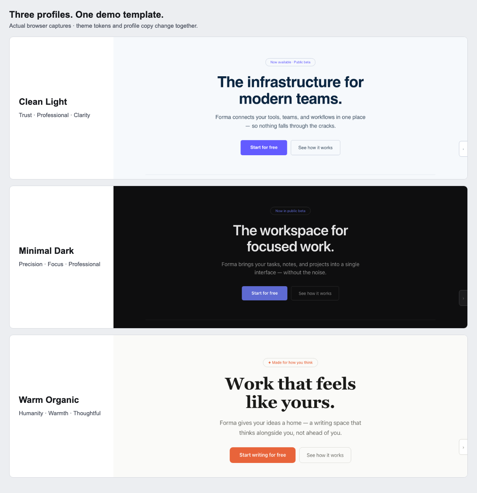
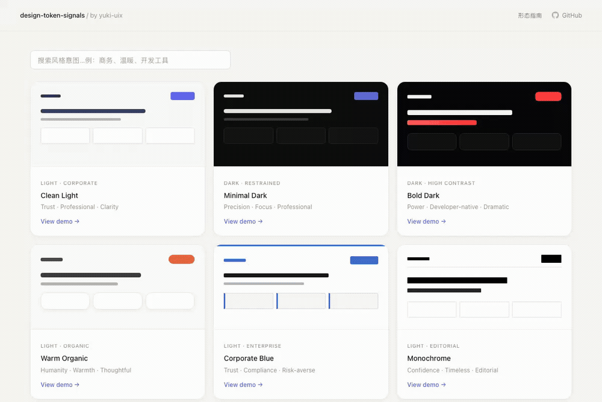

# design-token-signals

Choose a visual style, understand its design choices, and export tokens your AI coding assistant can use as a reference.

**[Try the live demo](https://yuki-uix.github.io/design-token-signals/)** · [Open Minimal Dark](https://yuki-uix.github.io/design-token-signals/demo.html#minimal-dark) · [Use the sample](examples/minimal-dark/)



The same demo template in three profiles. Both theme tokens and profile copy change; these are real browser captures.

Nine profiles for developers who know how an interface should feel but need help choosing colors, typography, corners, and shadows. Each profile includes suggested uses, tradeoffs, and exports. No installation or account is needed to browse and export.

## Use it in three steps



The recording shows an actual `.signal.md` download. Static walkthrough: [choose a profile](https://yuki-uix.github.io/design-token-signals/) → [open its demo and export](docs/images/minimal-dark-demo.png) → [reference the downloaded file](examples/minimal-dark/minimal-dark.signal.md) in your project.

1. **Choose a profile.** Open the [gallery](https://yuki-uix.github.io/design-token-signals/), search for an intent such as `professional` or `warm`, and open a theme. The demo switcher lets you explore all nine profiles.
2. **Export the reference.** Click **导出 .signal.md** in the demo sidebar. The Markdown file contains the profile's intent, suggested uses, rationale, and 29 theme variables. CSS and JSON exports are also available.
3. **Reference the file explicitly.** Put it in your project and tell your coding assistant which file to read. For the included sample:

   ```text
   Read examples/minimal-dark/minimal-dark.signal.md before changing the UI.
   Create a responsive project overview with a heading, a primary action,
   three summary cards, and a recent-activity list.
   Apply the exported variables in a shared :root stylesheet and use them
   in the components. Keep the existing project structure and interactions.
   Explain any additional layout values or deviations from the reference.
   ```

   If you downloaded the file into your project root, replace the path with `minimal-dark.signal.md`.

The file is a reference, not an automatically loaded agent rule. Explicitly attach or reference it in your assistant, and review the result. Tokens help specify a style; they do not guarantee consistent generated pages or replace layout, accessibility, and interaction decisions.

### Try the checked-in example

The [Minimal Dark example](examples/minimal-dark/) contains an unmodified browser export, the prompt used for a small standalone page, its HTML/CSS result, and a [verification record](docs/quickstart-verification.md). It requires no framework or build step. This is one implementation example, not a benchmark of model reliability.

The current export includes theme variables but **does not include the site's shared spacing scale or font files**. The example documents its added spacing choices and uses the exported system-font fallback. A CSS export already wraps variables in `:root`; the declarations inside `.signal.md` need that wrapper when used as CSS.

## Available profiles

| Profile | Intended character |
| --- | --- |
| [Clean Light](https://yuki-uix.github.io/design-token-signals/demo.html#clean-light) | Trust · Professional · Clarity |
| [Minimal Dark](https://yuki-uix.github.io/design-token-signals/demo.html#minimal-dark) | Precision · Focus · Professional |
| [Bold Dark](https://yuki-uix.github.io/design-token-signals/demo.html#bold-dark) | Power · Developer-native · Dramatic |
| [Warm Organic](https://yuki-uix.github.io/design-token-signals/demo.html#warm-organic) | Humanity · Warmth · Thoughtful |
| [Playful](https://yuki-uix.github.io/design-token-signals/demo.html#playful) | Energy · Expression · Delight |
| [Neo-Brutalist](https://yuki-uix.github.io/design-token-signals/demo.html#neo-brutalist) | Directness · Honesty · Anti-polish |
| [Corporate Blue](https://yuki-uix.github.io/design-token-signals/demo.html#corporate-blue) | Trust · Compliance · Risk-averse |
| [Monochrome](https://yuki-uix.github.io/design-token-signals/demo.html#monochrome) | Confidence · Timeless · Editorial |
| [AI Gradient](https://yuki-uix.github.io/design-token-signals/demo.html#ai-gradient) | Future · Ambition · Scale |

These are starting points for exploration, not rules about which industries may use a style. Brand references are inspiration, not official brand token sets.

## What is available today

- Keyword filtering, live theme switching, and shareable theme URLs.
- A sidebar showing token choices, rationale, and suggested use cases.
- `.signal.md`, CSS, and flat JSON exports. The JSON is a map of CSS variable names to values, not a DTCG-format token package.
- [Product analyses](analysis/) of Linear, Raycast, and Craft, and an [IA × Token guide](https://yuki-uix.github.io/design-token-signals/ia.html).

**Conflict audit and an installable agent Skill are not shipped.** Audit is a [separate validation experiment](https://github.com/yuki-uix/design-token-signals/issues/52), with productization contingent on its results.

## Why “signals”?

A token choice can contribute to how an interface feels. Smaller corners may reinforce precision; larger corners may feel softer. Typography, spacing, component roles, content, and brand context affect that reading.

| Dimension | Questions to explore |
| --- | --- |
| Color | Cool or warm? Muted or saturated? Light or dark? |
| Typography | Formal or friendly? Traditional or modern? |
| Form | Dense or airy? Restrained or playful? |

These are interpretive lenses, not measured universal laws. Different radii can correctly express component hierarchy, and contrasting styles can be intentional. A combination needs context before it can be called a conflict. The [conflicts directory](conflicts/) currently outlines planned case studies; it is not a validated rules library.

Product analyses draw on DevTools inspection and [getdesign.md](https://getdesign.md). Signal interpretations are the author's design judgments.

## Run locally

From this repository, start a static server:

```sh
python3 -m http.server 4200
```

Open [localhost:4200](http://localhost:4200). Use HTTP rather than opening `demo.html` as a local file: export reads `tokens.css` through `fetch`.

The current nine-theme demo uses `tokens.css` and `js/demo.js`. The older `profiles/` directory contains three standalone explorations, not the full current theme catalog.
