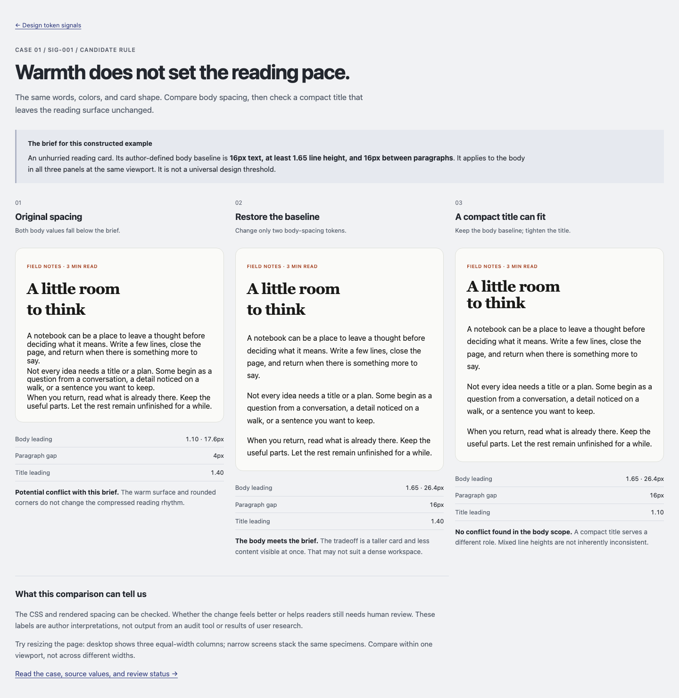

# Case 01 · Reading rhythm within a warm visual style

**Rule:** [SIG-001](rules.md#sig-001--reading-rhythm-departs-from-an-explicit-baseline). **Status:** authored, runnable comparison; independent human evaluation pending.

[Open the comparison](case-01/index.html) · [HTML](case-01/index.html) · [CSS inputs](case-01/styles.css)

The filename retains the original issue name, “playful meets formal.” The experiment is narrower: it tests body-spacing changes against a declared reading brief. It does not claim that warm colors, dark backgrounds, compact typography, or mixed radii are intrinsically incompatible.

## The feeling

The author-defined brief is an **unhurried reading card**, with 16px body text, a minimum line-height ratio of 1.65, and 16px between paragraphs. These values define this specimen's baseline at the checked viewports, not a design standard or a real client's requirement.

The first card has 1.1 leading and 4px paragraph gaps. The hypothesis is that its compressed body rhythm undermines the brief despite the warm surface and rounded corners. That is an interpretation for review, not a finding from users.

All three versions contain exactly the same title and body copy. Their fonts, body size, colors, padding, radius, and available width are held constant within each viewport. The second version changes two body tokens; the third changes only the title leading relative to the second version.

## The conflicting axes

The relevant dimensions are **typography and spacing within the reading body**, relative to the explicitly declared pace. Color and radius are controls, not evidence of conflict.

The specimen is related to [S1 and N1](examples/candidate-inputs.md) from #39. The repository's Warm Organic theme supplies the background `#fafaf8`, foreground `#1a1a18`, 16px body size, and 16px radius. The local body gap, title leading, category-label accent, padding, and example brief are authored for the experiment. Source snapshot: `tokens.css` at `82f82a1`.

A title is a separate role. The counterexample retains 1.1 title leading while the body meets the brief. Applying a rule about body paragraphs to that title would be a false positive.

## The specific tokens

All declarations are in [case-01/styles.css](case-01/styles.css). `.reading-copy` consumes the body size and leading; `.reading-copy p + p` consumes the paragraph gap. `.reading-title` consumes the title leading.

| Input | Original | Restore baseline | Counterexample |
| --- | --- | --- | --- |
| `--text-base` | 16px | 16px | 16px |
| `--reading-leading` | 1.1 | 1.65 | 1.65 |
| Resolved body line height | 17.6px | 26.4px | 26.4px |
| `--reading-paragraph-gap` | 4px | 16px | 16px |
| `--title-leading` | 1.4 | 1.4 | 1.1 |
| `--radius-lg` | 16px | 16px | 16px |

Paragraph margins are reset to zero before the explicit adjacent-paragraph gap is applied. This avoids an unaccounted default margin. The validation script measures the actual distance between paragraph boxes, not just the token string.



The panels show the same viewport and equal column widths. On narrow screens, they stack at equal widths. Typography wrapping can differ across operating systems; compare versions within the same browser/viewport.

## The resolution

The smallest proposed adjustment to the original is:

```css
/* Scope to this reading surface, not all text in the product. */
--reading-leading: 1.65;
--reading-paragraph-gap: 16px;
```

**Tradeoff:** the body becomes taller. Less content fits in the same height, and a long page may require more scrolling. If the actual task is a dense information display, the owner may reject this reading brief; the auditor should reconsider applicability instead of forcing a spacious style.

The counterexample deliberately changes `--title-leading` to 1.1 while retaining the restored body. Its compact two-line title is compatible with this body-specific brief. The expected SIG-001 result is `no-conflict-found` in the body scope, not a guarantee that every aspect of the design is correct.

Expected results with this supplied brief and rendered evidence:

- Original: `potential-conflict` because both body values fall below the accepted specimen baseline.
- Restored version: `no-conflict-found` under SIG-001.
- Compact-title counterexample: `no-conflict-found` under SIG-001 in the body scope.
- CSS without the brief, component use, or rendering: `insufficient-information`.

These are authored interpretations. No audit engine ran to produce them.

### Reproduce and verify

From the repository root, run `python3 -m http.server 4200`, then open `http://localhost:4200/conflicts/case-01/`. The example uses only local HTML/CSS and works without a build step, fonts service, or JavaScript.

With Playwright and its Chromium available to Node:

```sh
node scripts/verify-reading-case.cjs http://127.0.0.1:4200
```

The script checks identical copy and controlled styles, computed line heights, actual paragraph gaps, title-only counterexample changes, and mobile overflow. It captures the desktop comparison and prints measured body heights. Mobile review imagery is written to a temporary directory. These checks verify construction, not perceived quality or accessibility conformance.

### Recorded implementation checks

On 2026-09-20, Chromium 151.0.7922.34 rendered the page with JavaScript disabled. Both viewports passed identical-copy/style checks, computed spacing checks, keyboard skip-link order, and no horizontal overflow. Desktop and mobile renders were visually inspected by the implementation assistant.

| Viewport | Original body height | Restored body height | Counterexample body height |
| --- | --- | --- | --- |
| 1440 × 1100 | 166.34px | 269.52px | 269.52px |
| 390 × 844 | 219.13px | 348.69px | 348.69px |

These are body-box measurements in this environment, not expected constants across browsers. The script checks their relationships and the stated spacing values rather than freezing the heights.

### Human review record

**Independent human review: not yet conducted.** Automated measurements and the implementation assistant's visual inspection are not counted as this acceptance criterion. Keep #40 open until a human judgment is recorded, including disagreement.

Ask the reviewer to compare the page against the stated reading goal, then record:

| Question | Response |
| --- | --- |
| Does the original actually interfere with the intended reading pace? Why? | Pending |
| Is the restored version worth its extra height for this task? | Pending |
| Is the compact title a reasonable exception? | Pending |
| Would you adopt the change, keep the original, or revise the brief? | Pending |
| Reviewer / date / viewport / any disputed conclusion | Pending |

A reviewer can reasonably prefer the denser original. Record that as evidence about the brief or hypothesis; do not describe a lack of agreement as a user error.
