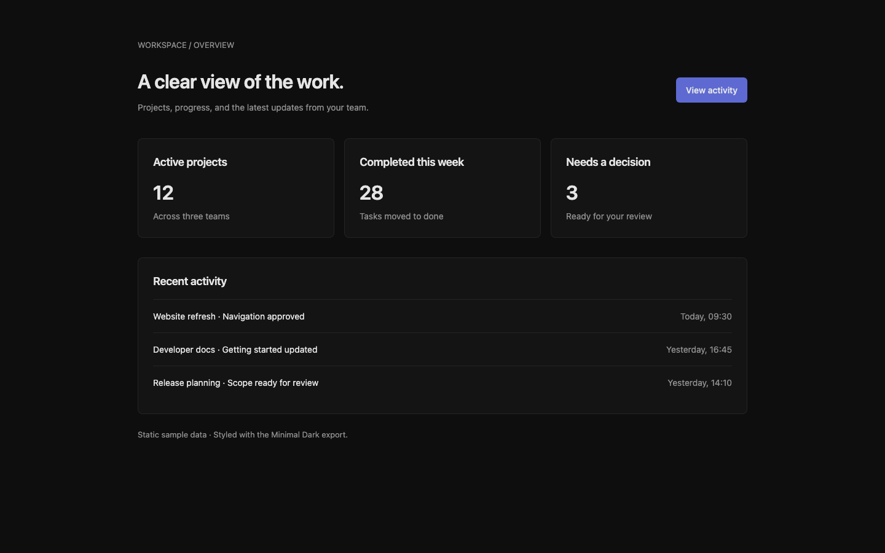

# Minimal Dark quickstart example

A small project overview built using the reference exported from the live demo code. This is a standalone example, not a full app.

- [minimal-dark.signal.md](minimal-dark.signal.md): unmodified browser download, including the current Chinese rationale and use-case text.
- [prompt.md](prompt.md): the implementation prompt for this example.
- [index.html](index.html) and [styles.css](styles.css): the resulting page and styles.
- [Verification record](../../docs/quickstart-verification.md): what was checked and what still needs external feedback.

From the repository root, run `python3 -m http.server 4200` and open [the example](http://localhost:4200/examples/minimal-dark/).

## Implementation choices

All 29 exported declarations are copied unchanged into `:root` in styles.css; components reference the appropriate variables. The page adds a 1040px maximum width, a 600px breakpoint, and spacing values for its layout because the current export does not include the gallery's shared spacing scale. It does not import the gallery stylesheet or JavaScript.

The font falls back to the system sans-serif when Inter is unavailable. The primary link navigates to recent activity. Data is static. These files show one use of the reference, not proof that an assistant will always follow it or that the profile is right for every product.

This is a checked-in export snapshot for reproducibility, not a new canonical theme data source. Re-export from the demo if you need the latest profile.
